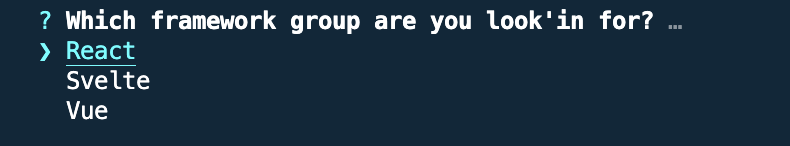
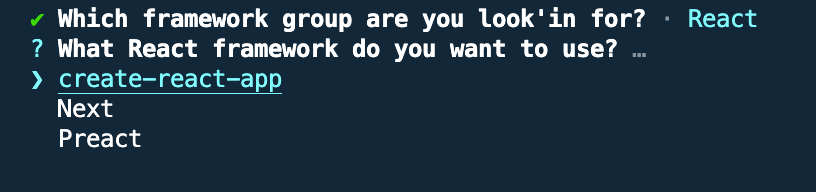

# JAM Stack Starters

## The easiest way to get started on your next web project

This CLI will walk you though your first project, and get you setup with the tools you need to build a modern web app.  There are no prerequisites, and no configuration.  Just run the command and you're ready to go.

1  `npm install -g jam-stack-starter`
2  `jam-stack-starter`
3  You will be prompted to name you project

4  Chose between React, Svelte, Vue, or Angulart

5  Once you've chosen, the appropriate framework will be installed for you.
6  `cd [The name of your project]`